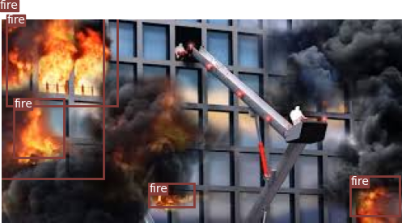
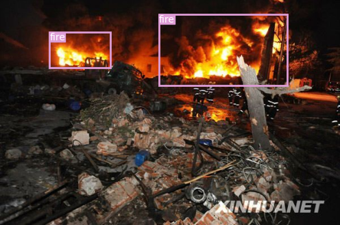
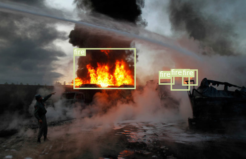
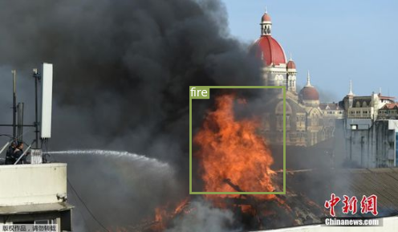

# YOLOV3-Fire-Detection

[csdn](https://blog.csdn.net/Mind_programmonkey)
[github](https://github.com/CodingChaozhang)

Yolov3的Pytorch版本实现火焰检测，其具体效果如下:










## Requirements

- 环境：windows10
- 编程语言：python
- 编程工具：pycharm
- 所需的包：requirements.txt 
## Train

### 1.安装包
本次所需的包在requirements.txt中，通过    `pip install -r requirements.txt` 即可。
### 2.所需权重文件
    $ cd weights/
    $ bash download_weights.sh
进入weights目录下，运行sh文件，即可下载本次所需权重，即darknet53.conv.74,yolov3.weights,yolov3-tiny.weights
### 3.修改配置文件信息
    $ cd config/
    $ bash create_custom_model.sh <num_classes>
进入config目录。执行`bash create_custom_model.sh <num_classes>`，其中`num_classes`为类别参数，根据你的需要修改，本次设置为1

执行上述完毕之后，修改custom.data文件，修改其中的`classes`的参数以及配置文件的路径即可。
### 4.配置yolov3的数据格式
    $ python voc2yolov3.py/
    $ python voc_anotation.py

首先你需要准备好voc格式的数据，之后将voc格式的数据转为本次所需的数据格式。

数据格式内容为：
- 每一张图像对应一个txt标注信息；
- txt中第一列为类别信息
- txt中剩下四列为标准化后的标注信息
    - <1>*w = (xmax-xmin)/2+xmin
    - <2>*h = (ymax-ymin)/2+ymin
    - <3>   = (xmax-xmin)/w
    - <4>   = (ymax-ymin)/h
### 5.运行
```
# 训练
python train.py --model_def config/yolov3-custom.cfg --data_config config/custom.data --pretrained_weights weights/darknet53.conv.74
    
# 从中断的地方开始训练
python train.py --model_def config/yolov3-custom.cfg --data_config config/custom.data --pretrained_weights checkpoints/yolov3_ckpt_99.pth --epoch 

```

若出现警告`UserWarning: indexing with dtype torch.uint8 is now deprecated, please use a dtype torch.bool instead.`
则修改`model.py`的代码，在大约192行左右添加一下两句：
```
obj_mask=obj_mask.bool() # convert int8 to bool

noobj_mask=noobj_mask.bool() #convert int8 to bool
```

训练日志如下：
```
---- [Epoch 7/100, Batch 7300/14658] ----
+------------+--------------+--------------+--------------+
| Metrics    | YOLO Layer 0 | YOLO Layer 1 | YOLO Layer 2 |
+------------+--------------+--------------+--------------+
| grid_size  | 16           | 32           | 64           |
| loss       | 1.554926     | 1.446884     | 1.427585     |
| x          | 0.028157     | 0.044483     | 0.051159     |
| y          | 0.040524     | 0.035687     | 0.046307     |
| w          | 0.078980     | 0.066310     | 0.027984     |
| h          | 0.133414     | 0.094540     | 0.037121     |
| conf       | 1.234448     | 1.165665     | 1.223495     |
| cls        | 0.039402     | 0.040198     | 0.041520     |
| cls_acc    | 44.44%       | 43.59%       | 32.50%       |
| recall50   | 0.361111     | 0.384615     | 0.300000     |
| recall75   | 0.222222     | 0.282051     | 0.300000     |
| precision  | 0.520000     | 0.300000     | 0.070175     |
| conf_obj   | 0.599058     | 0.622685     | 0.651472     |
| conf_noobj | 0.003778     | 0.004039     | 0.004044     |
+------------+--------------+--------------+--------------+
Total Loss 4.429395
---- ETA 0:35:48.821929
```

### 6.Tensorboard可视化

* Go to http://localhost:6006/

```
$ tensorboard --logdir='logs\' --port=6006
```

### 7.测试
```
python detect.py --image_folder data/imgs/ --weights_path checkpoints/yolov3_ckpt_99.pth --model_def config/yolov3-custom.cfg --class_path data/custom/classes.names
```

## 参考
https://github.com/ModelBunker/YOLOv3-PyTorch

## License
This project use the [MIT license](https://opensource.org/licenses/MIT).


